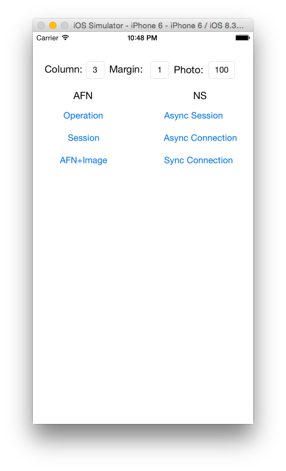
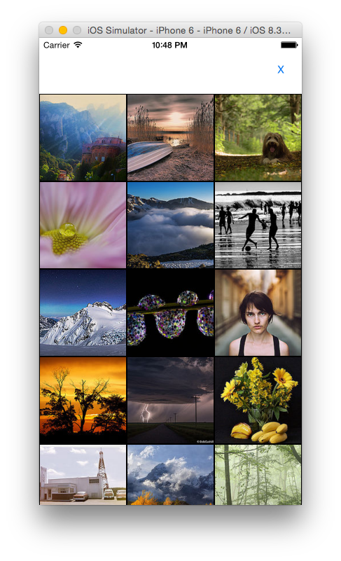

# ImageCollectionNSandAFN
Sample code for ImageCollection.

## Description
ImageCollectionNSandAFN is the iOS program that verifies the image display method.  

I made a comparison with AFNetworking and NSURL.  
- Image processing of AFNetworking
  - AFHTTPRequestOperationManager
  - AFHTTPSessionManager
  - UIImageView+AFNetworking
- NSUR
  - NSURLSession
  - NSURLConnection(asynchronous)
  - NSURLConnection(synchronous)

Programming language is written in swift2.0.

## Installation

    $ git clone https://github.com/amarron1/ImageCollectionNSandAFN.git

